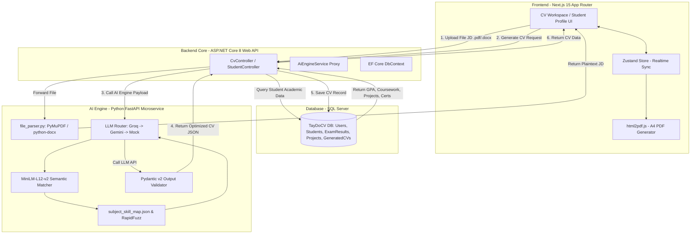

# BÁO CÁO TỔNG QUAN DỰ ÁN AIGENERALCV
## Hệ Thống Tối Ưu Hóa & Tạo CV Tự Động Cho Sinh Viên Dựa Trên Năng Lực Học Tập & AI

---

### I. TỔNG QUAN DỰ ÁN & BÀI TOÁN THỰC TẾ

#### 1. Bối cảnh & Lý do thực hiện
Hiện nay, sinh viên ngành Công nghệ Thông tin (CNTT) và Kỹ thuật Phần mềm khi chuẩn bị đi thực tập hoặc ứng tuyển việc làm thường gặp phải những khó khăn lớn:
- **Nội dung CV chung chung, thiếu điểm nhấn:** Sinh viên không biết cách trích xuất các môn học có điểm số cao hoặc các đồ án thực tế phù hợp nhất với từng vị trí công việc (Job Description - JD).
- **Vi phạm định dạng ATS (Applicant Tracking System):** CV quá dài (trôi sang trang 2 với khoảng trắng thừa), trình bày màu sắc sặc sỡ hoặc dùng các bảng biểu/khung viền phức tạp khiến phần mềm đọc CV tự động loại bỏ.
- **Tốn thời gian chỉnh sửa thủ công:** Mỗi tin tuyển dụng yêu cầu một bộ kỹ năng khác nhau, việc sửa CV thủ công cho từng doanh nghiệp mất nhiều thời gian và hay bị sót từ khóa quan trọng.

#### 2. Mục tiêu dự án AIGeneralCV
Xây dựng một hệ thống phần mềm toàn diện giúp **tự động hóa quá trình phân tích Job Description (JD) và tạo ra CV chuẩn ATS (đúng 1 trang A4)** dựa trên **dữ liệu năng lực học tập thực tế của sinh viên** (điểm môn học, đánh giá PLO/CLO, đồ án cá nhân, chứng chỉ).

---

### II. TỔNG HỢP KIẾN THỨC, KỸ NĂNG, THƯ VIỆN & CÔNG CỤ SỬ DỤNG
*(Tổ hợp kiến thức chuyên môn, thư viện và công cụ được lựa chọn kèm lý do tại sao sử dụng & lợi ích thực tế mang lại)*

#### 1. Frontend Layer (Giao diện người dùng)
| Công nghệ / Thư viện | Lý do lựa chọn | Lợi ích & Tác dụng thực tế trong dự án |
|---|---|---|
| **Next.js 15 (React 19, App Router)** | Framework React hiện đại nhất, hỗ trợ Server/Client Components linh hoạt | Tăng tốc độ tải trang, SEO tốt, định tuyến trang sạch sẽ (`/cv-workspace`, `/student/profile`, `/settings`, `/cv-history`). |
| **Zustand** | Thư viện quản lý State siêu nhẹ, không boilerplate phức tạp như Redux | Quản lý state tập trung cho CV Workspace (`cvStore.js`), giúp đồng bộ real-time giữa panel tinh chỉnh bên trái và bản xem trước CV A4 bên phải. |
| **Vanilla CSS & Design System 8pt Grid** | Tối ưu dung lượng bundle, dễ tùy biến giao diện đối xứng Light/Dark Mode | Đảm bảo tính nhất quán về khoảng cách (spacing tokens), font chữ, màu sắc; không bị phụ thuộc vào các UI framework nặng. |
| **Lucide React** | Bộ icon SVG dạng component nhẹ, hỗ trợ nhiều biểu tượng chuẩn UX | Cung cấp icon sắc nét cho các nút thao tác, trạng thái AI, đính kèm file, cảnh báo và điều hướng. |
| **Recharts** | Thư viện vẽ biểu đồ chuẩn React | Vẽ biểu đồ Radar Chart thể hiện mức độ đạt chuẩn đầu ra (PLO/CLO) của sinh viên trong trang Profile. |
| **`html2pdf.js` & `html2canvas`** | Giải pháp render HTML ra file PDF phẳng client-side | Cho phép xuất CV từ DOM HTML thành file PDF vector sắc nét chuẩn 1 trang A4 mà không bị vỡ layout hay tạo trang trắng thừa. |

#### 2. Backend Core Layer (Quản lý nghiệp vụ & Dữ liệu)
| Công nghệ / Thư viện | Lý do lựa chọn | Lợi ích & Tác dụng thực tế trong dự án |
|---|---|---|
| **ASP.NET Core 8.0 Web API** | Framework Backend doanh nghiệp mạnh mẽ của Microsoft, hiệu năng cực cao | Đảm nhận xử lý logic nghiệp vụ, quản lý cơ sở dữ liệu sinh viên, bảo mật API và làm cầu nối proxy giữa Frontend và AI-Engine. |
| **Entity Framework Core (EF Core)** | ORM hàng đầu cho .NET, thao tác dữ liệu qua LINQ strongly-typed | Quản lý truy vấn dữ liệu học tập (`ExamResults`, `Projects`, `Certificates`, `Students`, `Majors`) một cách an toàn, chống SQL Injection. |
| **Microsoft SQL Server** | Hệ quản trị cơ sở dữ liệu quan hệ tin cậy | Lưu trữ toàn bộ dữ liệu sinh viên, bảng điểm môn học, danh mục đồ án và các bản CV đã lưu (`GeneratedCVs`). |
| **JWT (JSON Web Token) & BCrypt** | Chuẩn xác thực phân quyền an toàn phổ biến | Mã hóa mật khẩu người dùng, bảo mật các endpoint API, duy trì phiên đăng nhập sinh viên. |
| **`IFormFile` (Multipart Upload)** | Hỗ trợ nhận file binary từ client | Làm endpoint proxy `POST /api/cv/parse-jd-file` tiếp nhận file PDF/DOCX từ Frontend và chuyển tiếp sang AI-Engine. |

#### 3. AI Engine Layer (Bộ não AI & Phân tích ngữ nghĩa)
| Công nghệ / Thư viện | Lý do lựa chọn | Lợi ích & Tác dụng thực tế trong dự án |
|---|---|---|
| **Python FastAPI (Uvicorn ASGI)** | Framework microservice Python tốc độ cao, xử lý bất đồng bộ `async/await` tốt | Xây dựng dịch vụ AI độc lập, tiếp nhận yêu cầu phân tích JD và sinh CV từ Backend .NET. |
| **PyMuPDF (`fitz`)** | Thư viện đọc & trích xuất text từ file PDF cực nhanh và chuẩn xác | Trích xuất toàn bộ nội dung văn bản từ các file Job Description dạng PDF do nhà tuyển dụng cung cấp. |
| **`python-docx`** | Thư viện xử lý file Microsoft Word (`.docx`) | Đọc nội dung văn bản thuần từ các file JD định dạng `.docx` mà không làm mất định dạng dòng. |
| **`sentence-transformers` (`paraphrase-multilingual-MiniLM-L12-v2`)** | Model Semantic Embedding đa ngôn ngữ chạy cục bộ (HuggingFace) | Phân tích vector ngữ nghĩa để so khớp mức độ tương đồng giữa yêu cầu tuyển dụng (JD) và năng lực sinh viên (Subject/Skills). |
| **`RapidFuzz` & Unicodedata** | Thư viện so khớp chuỗi mờ (Fuzzy matching) siêu tốc | Chuẩn hóa tiếng Việt có dấu, so khớp tên môn học trong bảng điểm với bộ kỹ năng ngành CNTT (`subject_skill_map.json`). |
| **Pydantic v2** | Thư viện validate dữ liệu và định nghĩa Schema cho Python | Ép cấu trúc đầu ra của LLM phải tuân thủ 100% định dạng JSON mong muốn (`CvData`), không bị gãy cú pháp. |
| **Groq API (`llama-3.1-8b-instant`)** | LPU Hardware tăng tốc inference LLM với tốc độ > 300 tokens/s | Sinh nội dung CV thần tốc (chỉ mất 2-3 giây) với ngôn ngữ chuyên nghiệp và câu từ chuẩn ATS. |
| **Google Gemini API (`gemini-2.0-flash`)** | Model AI thế hệ mới của Google với khả năng suy luận tốt | Làm kênh dự phòng (Failover Layer) khi Groq API gặp sự cố hoặc quá tải rate limit. |

#### 4. Công cụ hỗ trợ & Môi trường phát triển
- **Git / GitHub:** Quản lý phiên bản mã nguồn cho cả 3 thành phần (Frontend, Backend, AI-Engine).
- **Uvicorn & .NET CLI:** Quản lý quá trình chạy ứng dụng phát triển cục bộ với tính năng auto-reload.
- **Visual Studio & VS Code:** Môi trường lập trình chính tích hợp debugger cho C# và Python/JS.
- **Gemini Antigravity Agent:** Trợ lý AI pair-programming hỗ trợ tái cấu trúc mã nguồn, phát triển giao diện đối xứng Light/Dark Mode và tối ưu thuật toán.

---

### III. KIẾN TRÚC HỆ THỐNG & SƠ ĐỒ LUỒNG DỮ LIỆU

Dự án được xây dựng theo kiến trúc **Microservices 3 tầng (3-Tier Microservices Architecture)** tách biệt hoàn toàn giữa Giao diện (Frontend), Nghiệp vụ dữ liệu (Backend Core) và Bộ não AI (AI Engine).

---

### IV. LUỒNG HOẠT ĐỘNG CHI TIẾT CỦA CÁC CHỨC NĂNG (FLOW OF FEATURES)

#### 1. Luồng 1: Tiếp nhận & Trích xuất Job Description (JD Input Phase)
- **Cách 1 - Dán văn bản:** Sinh viên copy nội dung tin tuyển dụng và dán trực tiếp vào khung `textarea`.
- **Cách 2 - Đính kèm file (PDF / DOCX / TXT):**
  1. Sinh viên kéo thả hoặc bấm nút **"Tải file JD (.pdf, .docx, .txt)"**.
  2. Giao diện hiển thị ngay chip đính kèm file `📎 filename.pdf (34.8 KB)` cùng hiệu ứng loading trích xuất.
  3. Frontend gọi API `POST /api/cv/parse-jd-file` (Backend .NET).
  4. Backend .NET nhận `IFormFile` và forward dạng `multipart/form-data` sang AI-Engine endpoint `POST /api/v1/extract-jd-text`.
  5. AI-Engine nhận file binary:
     - Nếu `.pdf`: `PyMuPDF` (`fitz`) đọc từng trang, trích xuất text và loại bỏ dòng rác.
     - Nếu `.docx`: `python-docx` duyệt qua từng đoạn văn (paragraph) lấy text thuần.
     - Nếu `.txt`: Đọc trực tiếp định dạng UTF-8.
  6. AI-Engine trả về văn bản sạch ➔ Backend ➔ Frontend dán tự động vào khung JD.

#### 2. Luồng 2: Quy trình AI Phân tích & Sinh CV (CV Generation & AI Pipeline)
Khi sinh viên bấm nút **"Phân tích JD & Tối ưu hóa CV với AI"**:
1. **Thu thập dữ liệu học tập từ SQL Server (Backend .NET):**
   - Lấy thông tin cá nhân: Họ tên, Ngành học, Mã sinh viên.
   - Lấy danh sách điểm thi (`ExamResults` ➔ `SubjectTeachings` ➔ `Subjects`): Tự động tính GPA quy đổi thang 4.0 và gom các môn học có điểm từ 7.0/10 trở lên.
   - Lấy danh sách Đồ án thực tế (`Projects`): Tên đồ án, Vai trò, Công nghệ sử dụng, Mô tả thô, Link GitHub, Link Demo.
   - Lấy danh sách Chứng chỉ (`Certificates`): Tên chứng chỉ, Nơi cấp, Năm cấp.
2. **Gửi Payload sang AI Engine (FastAPI):**
   - Đóng gói thông tin thành `GenerateCvRequest` chứa `job_description`, `job_title` và `academic_context`.
3. **Quy trình RAG 5 bước tại AI Engine:**
   - **Bước 1 (Sanitization):** Loại bỏ ký tự đặc biệt, chuẩn hóa văn bản JD.
   - **Bước 2 (Semantic Skill Matching & Scoring):**
     - Dùng `sentence-transformers` mã hóa JD và bộ kỹ năng sinh viên thành Vector Embeddings.
     - Sử dụng `subject_skill_map.json` kết hợp `RapidFuzz` để đổi tên môn học (VD: *"Phát triển ứng dụng Node.js"*) ➔ Kỹ năng chuyên môn (`Node.js`, `REST API`, `Express`).
     - Tính tỷ lệ bao phủ kỹ năng (Coverage Ratio) ➔ **Chấm điểm khớp JD (Match Score %)**.
   - **Bước 3 (Prompt Building & Content Budgeting & Strict Relevance Filtering):**
     - Xây dựng Prompt chặt chẽ ép LLM đóng vai Chuyên gia tuyển dụng IT & ATS Specialist.
     - Áp dụng **Quy tắc Tuyệt đối về Dữ liệu & Tính Tương thích Chặt chẽ (Strict Relevance Rules)**:
       - *KHÔNG BỊA ĐỒ ÁN*: Chỉ dùng đồ án thực tế sinh viên đã có.
       - *Strict Relevance Filtering (Lọc triệt để nội dung không liên quan)*: Khi JD hoàn toàn lạ/lệch ngành so với hồ sơ sinh viên (ví dụ: học làm Dev nhưng ứng tuyển Helpdesk / IT Support / Marketing), hệ thống CHỈ đưa vào các dự án/kỹ năng có chứa từ khóa hoặc kỹ năng chuyển đổi (transferable skills) phù hợp với JD. Nếu một dự án hoặc kỹ năng **hoàn toàn 0% liên quan**, hệ thống **bắt buộc loại bỏ (OMIT)** khỏi CV (trả về `"projects": []` nếu 0% dự án khớp) thay vì cố chèn vào để lấp đầy khung A4.
       - *Ép khung 1 trang A4*: Mỗi đồ án phù hợp chỉ viết đúng 4 dòng bullet point bắt đầu bằng **Động từ hành động** (Action Verbs: *Xây dựng, Thiết kế, Tối ưu, Triển khai*).
       - *Bảo toàn Link*: Giữ nguyên link GitHub và Live Demo của các dự án phù hợp.
   - **Bước 4 (LLM Failover Pipeline):**
     - Ưu tiên gọi **Groq API** (`llama-3.1-8b-instant`) để đạt tốc độ sinh cực nhanh (~2 giây).
     - Nếu Groq lỗi hoặc hết quota ➔ Tự động chuyển vùng sang **Google Gemini API** (`gemini-2.0-flash`).
     - Nếu cả 2 API đều gặp sự cố ➔ Trả về **Mock Fallback Data** đảm bảo ứng dụng không bao giờ bị sập (Crash-free).
   - **Bước 5 (Pydantic Schema Validation):**
     - Ép đầu ra LLM qua `CvData` schema của Pydantic v2 để đảm bảo JSON trả về luôn đúng định dạng.
4. **Lưu vết Lịch sử (Backend .NET):**
   - Nhận kết quả từ AI-Engine ➔ Lưu nguyên khối JSON kết quả vào bảng `GeneratedCVs` trong SQL Server cùng Match Score và ngày tạo.

#### 3. Luồng 3: Chỉnh sửa Real-time & Xuất bản CV (Editing & PDF Export Phase)
1. **Chỉnh sửa Split-Screen:**
   - Giao diện chia làm 2 cột: Bên trái là Panel điều khiển (Vòng tròn Match Score %, Thẻ từ khóa còn thiếu, Thông tin cá nhân, Mục tiêu nghề nghiệp), Bên phải là Bản xem trước CV A4.
   - Tất cả thao tác sửa đổi trên Panel trái được lưu vào `cvStore` (Zustand) và cập nhật tức thì (Real-time) sang bản preview A4 bên phải.
2. **Tiện ích "Từ khóa còn thiếu" (Missing Keywords):**
   - Hiển thị danh sách các từ khóa hot có trong JD nhưng sinh viên chưa có trong CV.
   - Sinh viên bấm vào tag từ khóa `+ Skill` ➔ Kỹ năng đó lập tức được chèn tự động vào mục Skills của CV và làm tăng điểm Match Score.
3. **Xuất file PDF phẳng chuẩn ATS (Strict 1-Page A4 PDF):**
   - Khi bấm **"Tải CV (PDF)"**, ứng dụng dùng `html2pdf.js` kết hợp `html2canvas`.
   - Cấu hình xuất file: `unit: 'mm'`, `format: 'a4'`, `orientation: 'portrait'`, `scale: 2`, `pagebreak: { mode: 'none' }`.
   - Thuật toán ép lề (`margin: 0`) và tính toán khoảng cách tự động đảm bảo CV phẳng 100%, không bao giờ trôi chữ sang trang 2.

#### 4. Luồng 4: Lưu trữ & Khôi phục Lịch sử (Storage & History Phase)
- Bản CV sau khi tạo được lưu trữ đồng thời ở **SQL Server (`GeneratedCVs`)** và **`localStorage` (`saved_cv_history`)**.
- Khi sinh viên truy cập trang **Lịch sử CV (`/cv-history`)**:
  - Có thể xem danh sách các bản CV đã từng tạo theo từng vị trí ứng tuyển.
  - Bấm **"Xem nhanh"** để mở lại trọn vẹn bản CV A4 cũ từ dữ liệu JSON đã lưu **mà KHÔNG phải tốn chi phí gọi lại AI token**.
  - Hỗ trợ tải PDF, sao chép hoặc xóa bản CV cũ.

---

### V. HỆ THỐNG GIAO DIỆN ĐỐI XỨNG (SYMMETRIC LIGHT/DARK THEME SYSTEM)

Dự án áp dụng hệ thống thiết kế giao diện đối xứng chuẩn hiện đại (Design Tokens) thông qua CSS Custom Properties trong file [`globals.css`](file:///c:/Users/HMean/Desktop/Báo cáo thực tập/AIGeneralCV/Frontend/src/app/globals.css):

1. **Bảng màu Slate-based cao cấp:**
   - **Light Mode (`:root`):** Nền chính `#F8FAFC` (Slate 50), Card bề mặt `#FFFFFF`, Chữ chính `#1E293B` (Slate 800), Viền `#E2E8F0`.
   - **Dark Mode (`:root[data-theme="dark"]`):** Nền chính `#0F172A` (Slate 900), Card bề mặt `#1E293B` (Slate 800), Sidebar `#0B1120` (Slate 950), Chữ chính `#F1F5F9` (Slate 100), Viền `#334155`.
2. **Cơ chế ThemeContext & Toggle:**
   - `ThemeContext.js` lưu trạng thái theme vào `localStorage` và tự động gắn thuộc tính `data-theme="dark"` hoặc `light` vào thẻ `<html>`.
   - Nút chuyển theme dạng icon Mặt trời ☀️ / Mặt trăng 🌙 trên thanh `TopHeader.js` giúp chuyển đổi mượt mà với hiệu ứng transition 300ms.
3. **Chuẩn hóa màu sắc trạng thái (Status Palette Consistency):**
   - **Success (Emerald):** Nền Light `#ECFDF5`, Nền Dark mờ `rgba(16, 185, 129, 0.15)`.
   - **Warning (Amber):** Thẻ *Từ khóa còn thiếu* dùng nền Light `#FFFBEB`, Nền Dark mờ dịu mắt `rgba(245, 158, 11, 0.15)` cùng viền `rgba(245, 158, 11, 0.3)` và chữ vàng hổ phách `#FBBF24` ➔ Loại bỏ hoàn toàn hiện tượng chói mắt khi ở chế độ tối.
   - **Match Score Ring:** Vòng tròn tiến trình `MatchScoreCircle.js` dùng `stroke="var(--color-border)"` giúp hiển thị rõ nét khung viền ở cả 2 chế độ sáng và tối.

---

### VI. KẾT QUẢ ĐẠT ĐƯỢC & HƯỚNG PHÁT TRIỂN

#### 1. Kết quả đạt được
- Hệ thống hoàn chỉnh 3 tầng (Frontend Next.js 15 ↔ Backend .NET Core 8 ↔ AI Engine FastAPI) kết nối và hoạt động trơn tru.
- Xử lý mượt mà cả 2 hình thức nhập JD: Dán văn bản hoặc Upload file PDF / DOCX / TXT.
- Xử lý an toàn và tin cậy **13 Edge Cases** (Bao gồm các trường hợp JD quá ngắn/dài, Prompt Injection, Quota Limit, bilingual, JD lệch ngành 0% match với lọc bỏ triệt để đồ án/kỹ năng không liên quan).
- Tốc độ phân tích & sinh CV siêu nhanh (trung bình **2 - 5 giây**).
- Bản CV xuất ra đạt tỷ lệ **100% chuẩn 1 trang A4 ATS**, trình bày trang trọng, không lỗi font hay tràn trang.
- Giao diện đối xứng Sáng / Tối (Light/Dark Mode) hoàn thiện sắc nét, nâng cao trải nghiệm người dùng.

#### 2. Hướng phát triển tiếp theo
- Hỗ trợ đa ngôn ngữ cho CV đầu ra (Tiếng Anh, Tiếng Nhật).
- Tích hợp thêm các Template CV mẫu đa dạng theo các ngành nghề khác ngoài CNTT.
- Kết nối API với các nền tảng tuyển dụng (TopCV, ITViec) để hỗ trợ nộp CV tự động.
